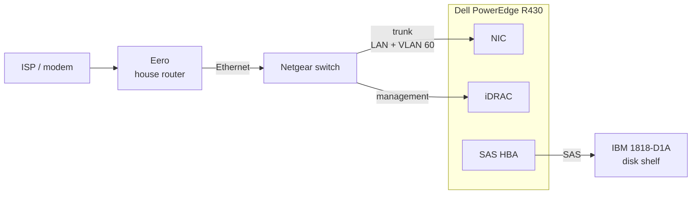

# Hardware Overview

The physical side of the lab — what the boxes are, how they're cabled, and what it actually
looks like.

## Photos

Drop images into `homelab/images/` and swap each placeholder line below for the image tag
underneath it.

**Rack, front**

> _Photo goes here — the rack front with the R430 and JBOD racked._
> _Save as `images/rack-front.jpg`, then replace this line with:_ ``

**R430, lid off**

> _Photo goes here — the R430 open, showing CPUs, RAM, and the HBA._
> _Save as `images/r430-internals.jpg`, then replace this line with:_ ``

**JBOD disk shelf**

> _Photo goes here — the IBM 1818-D1A with drive caddies in._
> _Save as `images/jbod-front.jpg`, then replace this line with:_ ``

**Cabling / rear**

> _Photo goes here — rear of the rack, SAS and Ethernet runs._
> _Save as `images/rack-rear.jpg`, then replace this line with:_ ``

## Compute

**Dell PowerEdge R430** — the whole lab runs on this one box.

| | |
|---|---|
| Form factor | 1U rack |
| CPU | _TODO — model and core count_ |
| RAM | _TODO — capacity and type_ |
| Boot storage | _TODO_ |
| Storage controller | _TODO — HBA / PERC model_ |
| Out-of-band mgmt | iDRAC |

## Storage

**IBM 1818-D1A** — external disk shelf hanging off the R430 over SAS.

| | |
|---|---|
| Type | JBOD / disk shelf |
| Bays | _TODO_ |
| Drives installed | _TODO — count, size, model_ |
| Connection | SAS to the R430's HBA |

## Networking

| Device | Role |
|---|---|
| Eero | Upstream router for the house, sits in front of the lab |
| Netgear switch | Everything in the lab plugs into this; carries the VLAN trunk |

## How it's wired

The switch carries a single trunk to the R430. OPNsense runs as a VM on that host and does
the actual splitting into LAN and VLAN 60, so the VLAN separation is logical rather than
separate physical runs — see the [network overview](network.md).

## Still to fill in

- [ ] CPU / RAM / drive specs above
- [ ] Confirm HBA model and whether iDRAC is actually cabled to the switch
- [ ] Power draw and UPS, if there is one
- [ ] Take and add the four photos

---

→ [Network overview](network.md) · [Services overview](services.md)
