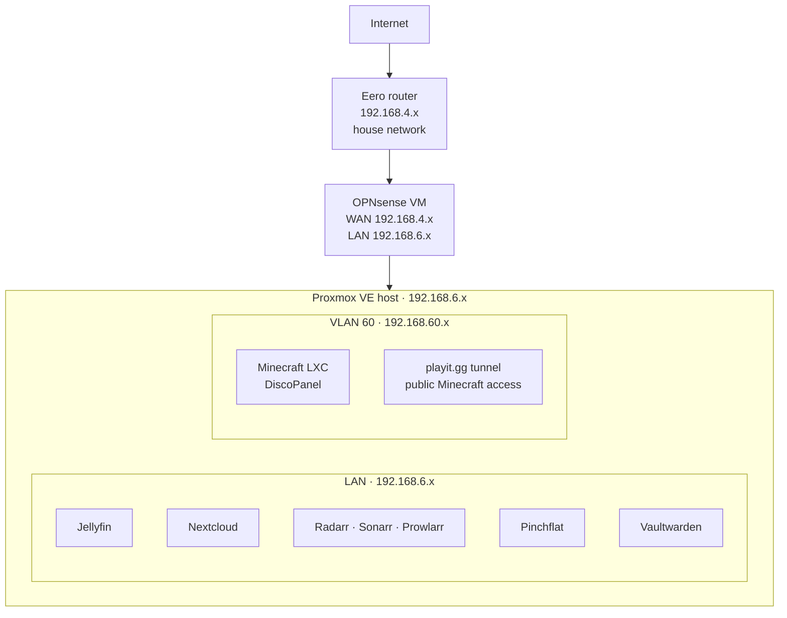

# Network Overview

How the lab is wired up. OPNsense sits between the house network and everything else, and
splits the lab into a few subnets.

## Diagram

## Subnets

| Interface | Network | What's on it |
|---|---|---|
| WAN | 192.168.4.x (Eero) | Upstream to the house network |
| LAN | 192.168.6.x | Proxmox and all the main services |
| VLAN 60 | 192.168.60.x | Game server, kept away from everything else |

## OPNsense

Runs as a VM on Proxmox and handles routing, firewall rules, and VLANs.

- **WAN** — plugs into the Eero network on a DHCP reservation so the address doesn't move.
- **LAN** — the main lab subnet where most services live.
- **VLAN 60** — separate subnet for the Minecraft server, so game traffic never touches the LAN.
- **Routing** — devices on the house network reach the lab through a static route pointing at OPNsense.
- **Remote access** — Tailscale, so nothing has to be exposed to the internet.

Host addresses are masked in these docs on purpose.

---

→ [Hardware overview](hardware.md) · [Services overview](services.md)
